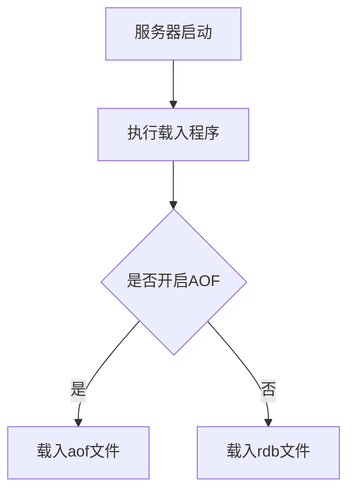
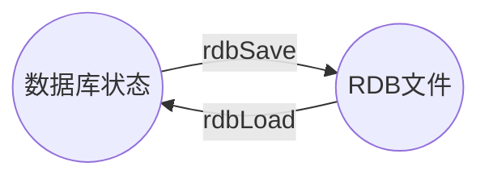

# 基本概念

## 目标

理解save命令以及bgsave命令的实现！

## RDB文件的创建与载入

#### 创建

两个redis命令可以生成RDB文件：save和bgsave。

save命令会阻塞服务器，知道RDB文件创建完成，因redis内存操作单进程缘故，阻塞期间服务器不能处理任何命令请求。

bgsave命令与save命令不同，它不会阻塞服务器命令请求，bgsave会派生一个子进程，由子进程负责创建RDB文件，服务器进程继续处理命令请求。

创建RDB文件的实际工作由 rdb.c/rebSave 函数实现，以下为伪码：

```c
def save():
 // 创建RDB文件
 rdbsave()
   
//=================
def bgsave():
	// 创建子进程
	pid = fork()
    
  if pid == 0 :
		// 子进程负责创建RDB文件
		rdbsave()
    // 完成后向父进程发送信号
    signal_parent()
      
   else if pid >0 :
		// 父进程继续处理命令请求，轮询等待子进程信号
		handle_request_and_wait_signal()
   else
     // 处理错误情况
     handle_fork_error()
```

#### 载入

与创建不同，载入实在服务器启动时自动进行的。所以redis没有专门用于载入rdb文件的命令，只要服务启动时识别到RDB文件存在，就会自动载入

> ps: 因为AOF文件更新频率一般比RDB文件高
>
> - 如果服务器开启AOF持久化，那么服务器会优先使用AOF文件还原数据库状态
> - 只有在AOF功能关闭时，才会使用RDB文件来还愿数据库状态

载入RDB文件实际由rdb.c/rdbLoad函数完成，流程如下：



 rdbLoad 与 rdbSave 之间的关系如下



### save 命令执行时 服务器状态

如前面所述：在执行save命令时，redis服务器会被阻塞，执行完save命令、重新开始接手命令请求之后，客户端发送的命令才会被处理

### BGSAVE 命令执行时的服务器状态

BGSAVE命令的保存工作是由子进程执行的，所以在子进程创建RDB文件的过程中，redis服务器还可以处理客户端发送过来的请求，但是处理save、bgsave、bgrewriteaof三个命令的方式会有所不同

首先在bgsave命令执行期间，客户端发送的save命令会被服务器拒绝，服务器禁止save命令与bgsave命令同时执行。是为了避免父进程和子进程同时执行两个rdbSave调用，防止产生竞争条件。

其次在bgsave命令执行期间，客户端发送的bgsave命令也会被拒绝，同样会产生竞争条件。

最后BGREWRITEAOF与BGSAVE两个命令不能同时执行！

- 如果bgsave命令正在执行，那么bgrewriteaof命令会被延迟到bgsave命令执行完成后执行
- 如果bgrewriteaof命令正在执行，那么bgsave命令则会被拒绝

bgrewriteaof与bgsave，两个命令都是由子进程执行，在命令执行方面没有什么冲突的地方，但是两个子进程都包含大量的磁盘写入操作，对服务器性能有所影响。

### RDB文件载入时服务器状态

会一直阻塞到RDB文件载入完成后，接收来自客户端的命令。


## 自动间隔性保存

因为bgsave命令可以在不阻塞服务器进程的情况下执行，所以redis允许用户通过设置服务器配置的save选项，让服务器每隔一段时间自动执行一次bgsave命令

用户可以通过save选项设置多个保存条件，只要其中任意一个满足，服务器就会执行bgsave命令。如下配置：

```shell
save 900 1 
save 300 10 
save 60 10000
```

即满足如下三个条件则会执行bgsave命令

- 服务器在900s内有1次写操作
- 服务器在300s内有10次写操作
- 服务器在60s内有10000次写操作

### 设置保存条件

当redis服务器启动时，用户可以通过指定配置文件或者传入启动参数的方式设置save选项，如果用户未设置save选项，则服务器会为save选项设置默认条件，默认条件如上举例

接着，服务器程序会根据save选项设置的保存条件，设置服务器状态redisServer结构的saveparams属性：

```c
struct redisServer{
  
  // ```
  
  struct saveparam *saveparams;
  
  //``
  
};
```

saveparams 属性时一个数组，数组中的每个元素都是一个saveparam结构，每个saveparam结构都保存了一个save选项都保存条件：

```c
struct saveparam {
  // 秒数
  time_t sesconds ; 
  // 修改数
  int changes；
};
```

### dirty 计数器与lastsave属性

除了saveparam数组外，服务器状态还维持着一个dirty计数器，以及一个lastsave属性：

- dirty 计数器记录距离上一次成功执行save或者bgsave命令之后，服务器对数据库状态（服务器中的所有数据库）进行了多少次写操作
- lastsave属性是一个unix时间戳，记录了服务器上一次成功执行save或者bgsave命令的时间。

```c
struct redisServer{
  // 修改计数器
  long long dirty;
  // 上次执行保存的时间
  time_t lastsave;
  // ```
}
```

当服务器成功执行一个写命令时，程序就会对dirth计数器进行检查更新（从0递增）

当服务器成功执行save或者bgsave命令时，程序就会dirty进行清零，并且将lastsave的修改为当前时间

### 检查保存时间是否满足条件

redis服务器周期性操作函数serverCron默认每隔100ms就会执行一次，该函数用于对正在运行的服务器进行维护，它其中一项工作就是检查save选项所设置的保存条件是否已经满足，如果满足便会执行bgsave命令：

```c
def serverCron():
	// 遍历保存条件
	for saveparam in server.saveparams
    // 计算时间差 （秒数）
    save_interval = unixtime_now() - server.lastsave
    // 满足条件则进行保存操作
    if server.dirty >= saveparam.changes and save_interval > saveparam.seconds:
			bgsave()
```

即程序遍历saveparams数组中所有的条件，只要一个条件满足则执行bgsave命令。


## 总结

- RDB文件 用于保存和还原redis服务器搜有数据库中的键值对数据
- save命令由服务器进程直接执行保存操作，该命令会阻塞服务器
- BGSave命令由子进程执行保存操作，所以该命令不会阻塞服务器
  - 对save、bgsave命令直接拒绝执行
  - 对bgrewriteaof 命令，会在bgsave执行完毕后执行
  - 在执行bgrewriteaof命令时，bgsave命令会被拒绝执行
- 服务器的结构体会保存所有save选项设置的保存条件，当任意一个保存条件被满足时，服务器会自动执行bgsave命令
- 对不同类型的键值对，rdb会采取不同的方式进行存储


