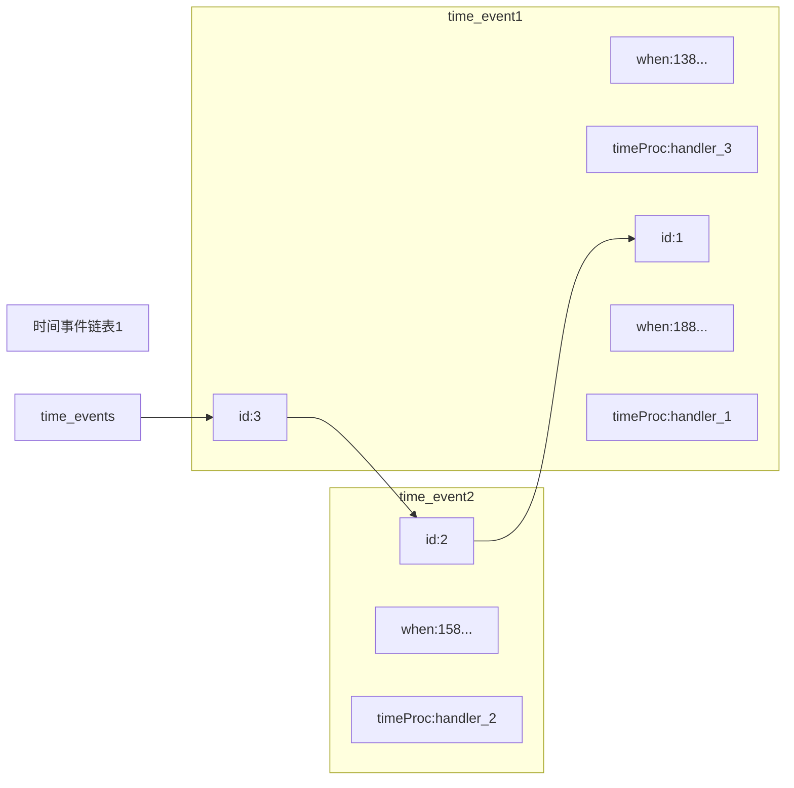
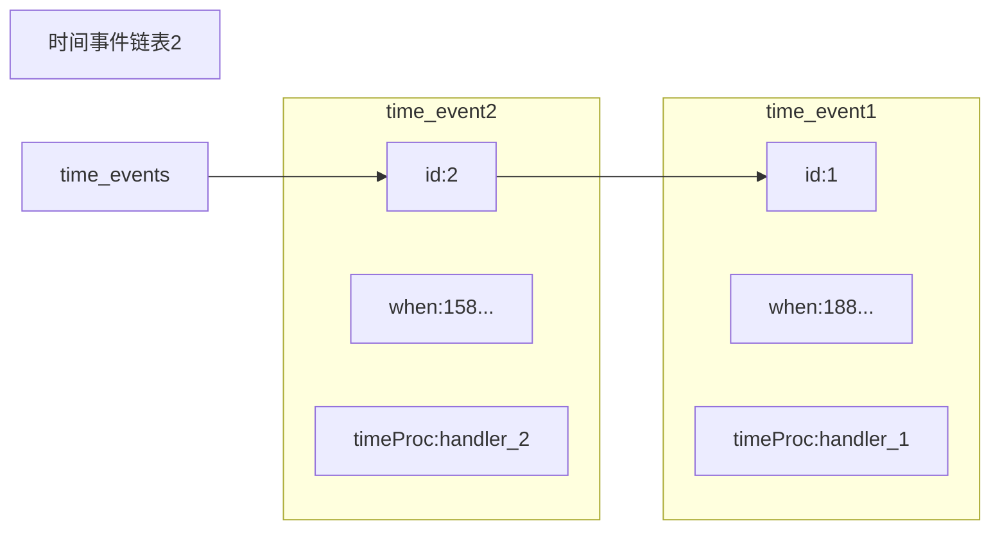
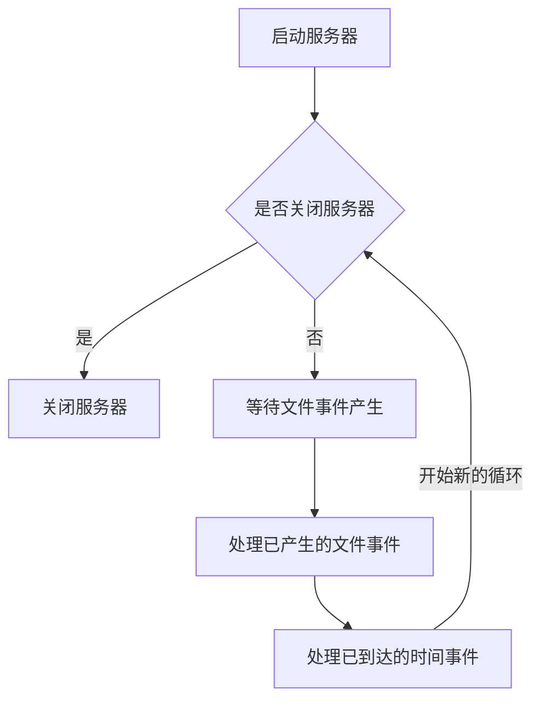

# 事件

Redis服务器是一个事件驱动程序，服务器需要处理以下两类事件：

- 文件时间（file event）：Redis 服务器通过套接字与客户端（或者其他redis服务器）进行连接，而文件时间就是服务器对套接字操作的抽象。服务器与客户端（或者其他服务器）的通信会产生相应的文件事件，而服务器则通过监听并处理这些事件来完成一系列网络操作
- 时间时间（time event）：Redis服务器中有一些操作（比如 serverCron 函数）需要在给定的时间点执行，二时间时间就是服务器对这类定时操作的抽象

## 文件事件

Redis 基于Reactor 模式开发了自己的网络事件处理器：这个处理器被称为文件时间处理器（file event handler）：

- 文件时间处理器使用I/O多路复用（multiplexing）程序来监听多个套接字，并根据套接字目前执行的任务来为套接字关联不同的事件处理器
- 当被监听的套接字准备好执行连接应答（accept）、读取（read）、写入（write）、关闭（close）等操作时，与操作相对应的文件事件就会产生，这时文件处理器就会调用套接字之前关联好的事件处理器来处理这些事件。

### 文件事件处理器构成


如上图所示，文件处理器由套接字、I/O多路复用程序、文件事件分派器以及事件处理器四部分组成。

文件事件是对套接字操作的抽象，每当一个套接字准备好执行连接应答（accept）、写入、读取、关闭等操作时，就会产生一个文件事件。因为一个服务器通常会连接多个套接字，所以多个文件事件有可能会并发地出现。

I/O 多路复用程序负责监听多个套接字，并向文件事件分派器传送那些产生了事件的套接字。

尽管多个文件事件可能会并发地出现，但I/O多路复用程序总是会讲所有产生事件等套接字都放到一个队列里面，然后通过这个队列，以有序（sequentially）、同步（synchronously），每次一个套接字的方式向文件事件分派器传送套接字。当上一个套接字产生的事件被处理完毕之后（该套接字为事件所关联的事件处理器执行完毕），I/O多路复用程序才会继续向文件事件分派器传送下一个套接字。

文件事件分派器接收I/O多路复用程序传来的套接字，并根据套接字产生的事件类型，调用相应的事件处理器。

服务器回味执行不同任务的套接字关联不同的事件处理器，这些处理器是一个个函数，它们定义了某个事件发生时，服务器应该执行的操作。

### I/O多路复用程序的实现

Redis的I/O多路复用程序的所有功能都是通过包装常见的select、epoll、evport和kqueue这些I/O多路复用的库函数来实现的，每个I/O多路复用函数库在redis源码中都对应一个单独的文件，比如ae_select.c、ae_epoll.c、ae_kqueue.c ，诸如此类。

因为redis为每个I/O多路复用函数库都实现了相同的api，所以I/O多路复用程序的底层实现时可以互换的。

Redis在I/O多路复用程序的实现源码中用 #incloude 宏定义了相应的规则，程序会在编译时自动选择系统中性能最高的I/O多路复用函数库来作为Redis的I/O多路复用程序的底层实现：

### 事件的类型

I/O多路复用程序可以监听多个套接字的ae.h/AE_READABLE 事件和 ae.h/AE_WRITABLE 事件，这两类事件和套接字操作之间的对应关系如下：

- 当套接字变得可读时（客户端对套接字执行write操作，或者执行close操作），或者有新的可应答（acceptable）套接字出现时（客户端对服务器的监听套接字执行connect操作），套接字产生AE_READABLE事件。
- 当套接字变得可写时（客户端对套接字执行read操作），套接字产生AE_WRITABLE事件

I/O 多路服务用程序允许服务器同时监听套接字的 AE_READABLE 事件和 AE_WRITABLE 事件，如果一个套接字同时产生了这两种事件，那么文件事件分派器会优先处理 AE_READABLE 事件，等到 AE_READABLE 事件处理完后，才处理 AE_WRITABLE 事件。（先读后写）

### API

ae.c/aeCreateFileEvent 函数接受一个套接字描述符、一个事件类型、以及一个事件处理器作为参数，将给定套接字的给定事件加入到I/O多路复用程序的监听范围之内，并对事件和事件处理器进行关联。

```c++
int aeCreateFileEvent(aeEventLoop *eventLoop, int fd, int mask,
        aeFileProc *proc, void *clientData)
{
    if (fd >= eventLoop->setsize) {
        errno = ERANGE;
        return AE_ERR;
    }
    aeFileEvent *fe = &eventLoop->events[fd];

    if (aeApiAddEvent(eventLoop, fd, mask) == -1)
        return AE_ERR;
    fe->mask |= mask;
    if (mask & AE_READABLE) fe->rfileProc = proc;
    if (mask & AE_WRITABLE) fe->wfileProc = proc;
    fe->clientData = clientData;
    if (fd > eventLoop->maxfd)
        eventLoop->maxfd = fd;
    return AE_OK;
}
```

ae.c/aeDeleteFileEvent 函数接受一个套接字描述符和一个监听事件类型作为参数，让I/O多路复用程序取消对给定套接字的给定事件的监听，并取消事件和事件处理器之间的关联

```c
void aeDeleteFileEvent(aeEventLoop *eventLoop, int fd, int mask)
{
    if (fd >= eventLoop->setsize) return;
    aeFileEvent *fe = &eventLoop->events[fd];
    if (fe->mask == AE_NONE) return;

    /* We want to always remove AE_BARRIER if set when AE_WRITABLE
     * is removed. */
    if (mask & AE_WRITABLE) mask |= AE_BARRIER;

    aeApiDelEvent(eventLoop, fd, mask);
    fe->mask = fe->mask & (~mask);
    if (fd == eventLoop->maxfd && fe->mask == AE_NONE) {
        /* Update the max fd */
        int j;

        for (j = eventLoop->maxfd-1; j >= 0; j--)
            if (eventLoop->events[j].mask != AE_NONE) break;
        eventLoop->maxfd = j;
    }
}
```

ae.c/aeGetFileEvents 函数接受一个套接字描述符，返回该套接字正在被监听的事件类型：

- 如果套接字没有任何事件被监听，那么函数返回AE_NONE。
- 如果套接字的读事件正在被监听，那么函数返回AE_READABLE。
- 如果套接字的写事件正在被监听，那么函数返回AE_WRITABLE。
- 如果套接字的读事件和写事件正在被监听，那么函数返回AE_READABLE|AE_WRITABLE。

```c++
int aeGetFileEvents(aeEventLoop *eventLoop, int fd) {
    if (fd >= eventLoop->setsize) return 0;
    aeFileEvent *fe = &eventLoop->events[fd];

    return fe->mask;
}
```

ae.c/aeWait 函数接受一个套接字描述符、一个事件类型和一个毫秒数为参数，在给定的事件内阻塞并等待套接字给定类型事件的产生，当事件成功产生或者等待超时之后，函数返回。

```c++
/* Wait for milliseconds until the given file descriptor becomes
 * writable/readable/exception */
int aeWait(int fd, int mask, long long milliseconds) {
    struct pollfd pfd;
    int retmask = 0, retval;

    memset(&pfd, 0, sizeof(pfd));
    pfd.fd = fd;
    if (mask & AE_READABLE) pfd.events |= POLLIN;
    if (mask & AE_WRITABLE) pfd.events |= POLLOUT;

    if ((retval = poll(&pfd, 1, milliseconds))== 1) {
        if (pfd.revents & POLLIN) retmask |= AE_READABLE;
        if (pfd.revents & POLLOUT) retmask |= AE_WRITABLE;
        if (pfd.revents & POLLERR) retmask |= AE_WRITABLE;
        if (pfd.revents & POLLHUP) retmask |= AE_WRITABLE;
        return retmask;
    } else {
        return retval;
    }
}
```

ae.c/aeApiPoll 函数接受一个 sys/time.h/struct  timval 结构为参数，并在指定的时间内，阻塞并等待所有被aeCreateFileEvent 函数设置为监听状态的套件字产生文件事件，当有至少一个事件产生，或者等待超时后，函数返回。

ae.c/aeProcessEvents 函数时文件事件分派器，它先调用 aeApiApoll 函数等待时间产生，然后遍历所有已产生时间，并调用相应的事件处理器来处理这些事件。

ae.c/aeGetApiName 函数返回I/O多路复用程序底层所嗲用的I/O多路复用函数库的名称：返回“epoll”表示底层为epoll函数库

### 文件事件的处理器

Redis 为文件事件编写了多个处理器，这些事件处理器分别用于实现不同的网络通信需求，比如说：

- 为了对连接服务器的哥哥客户端进行应答，服务器要为监听套接字关联连接应答处理器。
- 为了接受客户端传来的命令请求，服务器要为客户端套接字关联命令请求处理器。
- 为了向客户端返回命令的执行结果，服务器要为客户端套接字关联命令回复处理器。
- 当主服务器和从服务器进行复制操作时，主从服务器都需要关联特别为复制功能编写的复制处理器。

在这些事件处理器里面，服务最常用的要数与客户端进行通信的连接应答处理器、命令请求处理器和命令回复处理器。

1. 连接应答处理器

   network.c/acceptTcpHandler 函数是Redis的连接应答处理器，这个处理器用于对连接服务器监听套接字的客户端进行应答，具体实现为sys/socket.h/accept函数的包装

   当Redis服务器进行初始化的时候，程序会将这个连接应答处理器和服务器监听套接字的AE_READABLE 事件关联起来，当有客户端用 sys/socket.h/connect 函数连接服务器监听套接字的时候，套接字就会产生AE_CONNECT 事件，引发连接应答处理器执行，并执行相应的套接字应答操作。

   ```mermaid
   graph LR
   
   client((客户端))--> |连接监听套接字|server[服务器监听套接字产生AE_READABLE事件,执行命令请求处理器]
   ```

2. 命令请求处理器

   networking.c/readQueryFromClient 函数是Redis的命令请求处理器，这个处理器负责从套接字中读入可会淡发送的命令请求内容，具体实现为unistd.h/read 函数的包装

   当一个客户端通过连接应答处理器成功连接到服务器之后，服务器会将客户端套接字的AE_READABLE 事件和命令请求处理器关联起来，当客户端向服务器发送命令请求的时候，套接字就会产生 AE_READABLE 事件，引发命令请求处理器执行，并执行相应的套接字读入操作。

   在客户端连接服务器的整个过程中，服务器都会一直为客户端套接字的AE_READABLE事件关联命令请求处理器。

   ```mermaid
   graph LR
   
   client((客户端)) --> |连接监听套接字|server[客户端套接字产生AE_READABLE事件,执行命令请求处理器]
   ```

3. 命令回复处理器

   networking.c/sendReplyToClient 函数是redis 的命令回复处理器，这个处理器负责将服务器执行命令后得到的命令回复通过套接字返回给客户端，具体实现为 unistd.h/write 函数的包装

   当服务器有命令回复需要传送给客户端的时候，服务器会将客户端套接字的 AE_WRITABLE 事件和命令回复处理器关联起来，当客户端准备好接收服务器传回的命令回复时，就会产生AE_WRITABLE 事件，引发命令回复处理器执行，并执行相应的套接字写入操作。

   当命令回复发送完毕之后，服务器就会接触命令回复处理器与客户端套接字的AE_WRITABLE 事件之间的关联。

   ```mermaid
   graph RL
   
   server[客户端套接字产生AE_WRITABLE事件,执行命令回复处理器] --> |发送命令回复| client((客户端)) 
   ```

4. 一次完整的客户端与服务器连接事件示例

   让我们来追踪一次Redis客户端与服务器进行连接并发送命令的整个过程，看看在过程中会产生什么事件，而这些事件又是怎么被处理的。

   假设一个Redis服务器正在运作，那么这个服务器的监听套接字的AE_READABLE 事件应在正处于监听状态之下，而该事件所对应的处理器为连接应答处理器。

   如果这时有一个Redis客户端向服务器发起连接，那么监听套接字将产生 AE_READABLE 事件，触发连接应答处理器执行。处理器会对客户端的连接请求进行应答，然后创建客户端套接字，以及客户端状态，并将客户端套接字的AE_READABLE 事件与命令请求处理器进行关联，是的客户端可以想主服务器发送命令请求。

   之后，假设客户端向主服务器发送一个命令请求，那么客户端套接字将产生AE_READABLE 事件，引发命令请求处理器执行，处理器读取客户端的命令内容，然后传给相关程序去执行。

   执行命令将产生相应的命令回复，为了将这些命令回复传送回客户端，服务器会将客户端套接字的AE_WRITABLE 事件与命令回复处理器进行关联。当客户端尝试读取命令回复的时候，客户端套接字将会产生 AE_WRITABLE 事件，触发命令回复处理器执行，点那个命令回复处理器将命令回复全部写入到套接字之后，服务器就会解除客户端套接字的AE_WRITABLE 事件与命令回复处理器之间的关联。

   ```mermaid
   graph LR
   
   client[客户端]
   server[服务器]
   
   client --> |客户端向服务器发送连接请求,服务器执行连接应答处理器|server
   client --> |客户端向服务器发送命令请求,服务器执行命令请求处理器|server
   server --> |服务器向客户端发送命令回复,服务器执行命令回复处理器|client
   ```

   

## 时间事件

redis的时间事件分为以下两类：

- 定时事件：让一段程序在指定的时间之后执行一次。
- 周期性事件：让一段程序每个指定时间就执行一次。

----

一个时间事件主要由以下三个属性组成：

- id：服务器为时间事件创建的全局唯一ID（标识号）。ID号从小到大的顺序递增，新事件的ID号比旧事件的ID号大
- when：毫秒精度的UNIX事件戳，记录了时间事件的到达时间。
- timeProc：时间事件处理器，一个函数。当时间事件到达时，服务器就会调用相应的处理器来处理事件。

----

一个时间事件是定时事件还是周期性事件取决于时间事件处理器的返回值：

- 如果事件处理器返回 ae.h/AE_NOMORE ，那么这个事件为定时事件：该事件会在到达一次后删除，之后不会再到达
- 如果事件处理器返回一个非AE_NOMORE 的整数值，那么这个事件为周期性事件：当一个时间事件到达后，服务器会根据事件处理器返回的值，对时间事件的when属性进行更新，让这个事件在一段时间之后再次到达，并以这种方式一直更新并运行下去。

### 实现

服务器将所有时间事件都房子啊一个无序链表中，每当时间事件执行器运行时，它就遍历整个链表，查找到所有已到达的时间事件，并调用相应的事件处理器。



以上为一个时间事件链表的例子，链表中包含三个不同的时间事件：因为新的时间事件总是插入到链表头，所以三个时间事件分别按ID逆序排序。

我们说的保存时间事件的链表为无序链表，值得不是链表不按ID排序，而是说，该链表不按when属性大小排序。所以当时间事件执行器运行的时候，它必须遍历链表中的所有时间事件。

> #### 无序链表并不影响时间事件处理器的性能
>
> 正常模式下的Redis服务器只使用一个serverCron 一个时间事件，而在 benchmark 模式下，服务器也只使用两个时间事件。在这种情况下，无序链表退化为指针，并不影响时间执行性能。

### API

ae.c/aeCreateTimeEvent 函数接受一个 毫秒数 milliseconds 和一个时间事件处理器proc 作为参数，讲一个新的时间事件添加到服务器，这个新的时间事件将在当前事件的milliseconds毫秒之后到达，而事件处理器为proc。

如当前时间事件链表如下“时间事件链表2”，当程序以50毫秒和handler_3处理器作为参数，调用该函数，服务器将创建ID为3的时间事件，此时服务器所保存的时间事件将如“时间事件链表1”所示



ae.c/aeDeleteFileEvent 函数接受一个事件Id作为参数，然后从服务器中删除该时间事件。

即从“时间事件链表2”变为”时间事件链表1“

ae.c/aeSearchNearestTimer 函数返回到达时间距离当前时间最近的那个时间事件。

ae.c/processTimeEvents 函数时时间事件的执行器，这个函数回遍历所有时间事件，并调用事件处理器来处理那些已到达的时间事件。已到达值得时，when时间戳小于等于当前时间的时间事件。

### 时间事件应用实例：serverCron函数

持续运行Redis服务器需要定期对自身资源和状态进行检查和调整，从而确保服务器可以长期、稳定地运行，这些定期操作由redis.c/serverCron 函数负责执行。在redis 2.6版本以每秒10次的频率，2.8之后，可以由redis.conf中的hz参数进行配置。

其主要工作包括：

- 更新数据库的各类统计信息，比如时间占用、内存占用、数据库占用等
- 清理数据库中过期键值对
- 管理和清理连接失效的客户端
- 尝试进行AOF和RDB持久化操作
- 若是主服务器则对从服务器定期同步
- 若是集群模式，对集群进行定期同步和连接测试


## 时间的调度与执行

事件的调度和执行由ae.c/aeProcessEvents 函数负责，以下为伪码表示：

```c
def aeProcessEvents():
	# 获取到达事件最近的事件
  time_event = aeSearchNearestTimer()
  # 计算最接近的时间事件距离到达还有多少毫秒
  remaind_ms = time_event.when - unix_ts_now()
  # 若果事件已到达，则将remaind_ms 设置为0
  if remaind_ms < 0
    remaind_ms = 0
    
  # 根据remain_ms 的值，创建 timeval结构
  timeval = create_timeval_with_ms（remaind_ms)
  
  # 阻塞并等待文件事件产生，最大阻塞时间由传入的timeval结构决定
  aeApiPoll(timevale)
    
  # 处理所有已产生的文件事件
  processFileEvents()
    
  # 处理所有已到达的时间事件
  processTimeEvents()
```

> processFileEvents 在之前讲到的该函数时虚构，是直接写在 aeProcessEvents 中

将aeProcessEvents函数放在循环中，加上初始函数与清理函数，就构成了redis的主函数

```c
def main():
	# 初始化服务器
	init_server()
  # 循环处理事件
  while server_is_not_shutdown():
		aeProcessEvents()
      
  # 关闭服务器
  clean_server()
```

如下流程图：



事件调度和执行规则如下：

1. aeApiPoll函数的最大阻塞时间由到达事件最接近当前事件的时间事件决定，这个方法既可以避免服务器对时间事件的频繁轮询，也可以确保aeApiPoll函数不会阻塞过长时间。

2. 文件事件是随机出现的，如果等待并处理完一次文件事件之后，仍未有任何时间事件到达，那么服务器将再次等待并处理文件事件。随着文件事件的不断执行，时间会逐渐向时间事件所设置的到达事件逼近，并最终到到达时间，这时服务器开始处理到达的时间事件。

3. 对文件事件和时间事件的处理都是同步、有序、原子地执行，服务器不会中途中断事件处理 ，也不会对事件进行抢占，因此，文件事件和时间事件都会尽可能地减少程序对阻塞事件，并在有需要时主动让出执行权，从而降低事件饥饿的可能性。

   > 比如说，在命令回复处理器将一个命令回复卸乳到客户端套接字时，如果卸乳子结束超过了一个预设常量的话，命令回复处理器就会主动break跳出写入循环，将余下的数据流到下次再写；另外，时间事件也会将非常耗时的持久化操作放到子线程或者子进程中处理。

4. 因为时间事件在文件事件之后执行，并且事件之间不会出现抢占，所以时间事件的实际处理时间，通常会比时间事件设定的到达时间晚一点


## 重点回顾

- Redis服务器是一个事件驱动程序，服务器处理的事件分为时间事件和文件事件

- 文件事件处理器时基于<font color='red'>Reactor模式实现的网络通信程序</font>

- 文件事件时对套接字操作的抽象：每次套接字变为可应答（acceptable），可写（writable），可读（readable）时，相应的文件事件就会产生。<font color='red'>套接字状态</font>

- 文件事件分为AE_READABLE 事件（读事件）和AE_WRITABLE（写事件）两类。

- 时间事件分为周期性事件和定时事件：定时事件只会在指定时间到达一次，周期性事件则每隔一段时间到达一次

- 文件事件和时间事件是合作关系，服务器轮流处理，不存在抢占关系

- 时间事件的执行事件会比设定到达事件稍晚一点

  