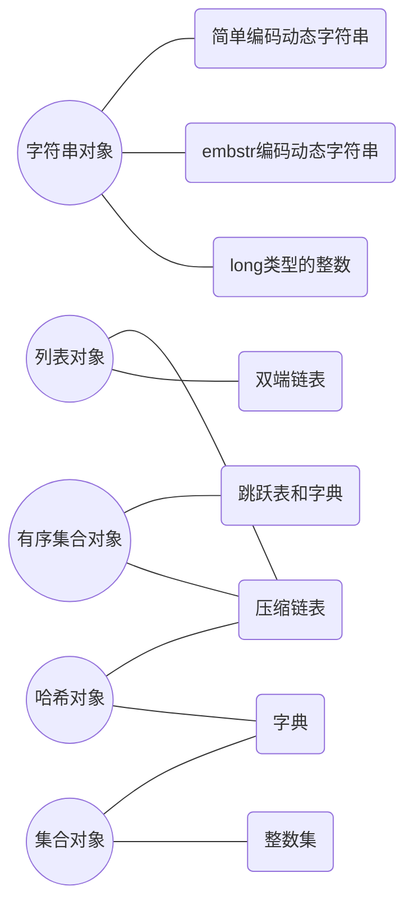

# Redis-数据结构

[toc]

## sds字符串

### 数据结构

```c
struct sdshdr {
    // 记录 buf 数组中已使用字节的数量
    // 等于 SDS 所保存字符串的长度
    int len;
    // 记录 buf 数组中未使用字节的数量
    int free;
    // 字节数组，用于保存字符串
    char buf[];
};
```

### sds对比c字符串的优势

- 因为len记录了字符串的长度，故在获取字符串长度的时候只要获取len的值，时间复杂度为O(1)；在c字符串中，需要遍历整个字符串，时间复杂度为O(n)。

- 杜绝缓冲区溢出

  假设两个字符串紧邻s1为redis，s2为mongoDB（c字符串，以‘\0’作为结尾）

  |      | S1   |      |      |      |      |      | s2   |      |      |      |      |      |      |      |      |      |
  | ---- | ---- | ---- | ---- | ---- | ---- | ---- | ---- | ---- | ---- | ---- | ---- | ---- | ---- | ---- | ---- | ---- |
  | ···  | 'r'  | 'e'  | 'd'  | 'i'  | 's'  | '\0' | 'm'  | 'o'  | 'n'  | 'g'  | 'o'  | 'D'  | 'B'  | '\0' | ···  |      |

  此时执行 strcat(s1," cluster");

  若用户粗心的未为其分配足够的内存，则s1的数据将溢出到s2的空间中，导致s2保存的内容意外被修改，如下表示

  |      |      |      |      |      |      |      |      |      |      |      |      |      |      |      |      |      |
  | ---- | ---- | ---- | ---- | ---- | ---- | ---- | ---- | ---- | ---- | ---- | ---- | ---- | ---- | ---- | ---- | ---- |
  | ··   | 'r'  | 'e'  | 'd'  | 'i'  | 's'  | ' '  | 'c'  | 'l'  | 'u'  | 's'  | 't'  | 'e'  | 'r'  | '\0' | ···  |      |

  与c不容，sds在空间分配策略杜绝了缓冲区溢出的可能性：当sds的api需要对sds进行修改时，api会先检查sds的空间是否满足修改所需的要求，如果不满足，api会自动将sds的空间扩展至执行修改所需的大小，然后执行追加操作。sds不需要手动修改sds空间大小，也就不存在缓冲区溢出

- 减少修改字符串时内存重分配次数

  一般程序中修改字符串长度的操作并不常见，每修改一次重新分配一次内存时可接受的。但是redis作为数据库，常用于速度要求苛刻，数据频繁修改的擦火锅暖和，如果每次修改字符串都进行一次内存的分配，对性能会造成极大的影响。

  - 空间预分配

    即当sds的API对一个sds对象进行修改并需要对sds进行空间扩展时，程序不仅会为sds分配所必须的空间，还会额外分配未使用空间。

    若增长后sds长度小于1MB，则分配与len属性同样大小的空间；

    若增场后sds长度大于等于1MB，则额外分配1M空间

    通过空间预分配策略，可以有效减少连续执行字符串增长时，内存分配的次数

  - 惰性空间释放

    惰性空间释放用于优化sds字符串缩短操作：当sds的api需要缩短sds保存的字符串时，程序并不立即使用内存重分配来回收缩短后多出来的字节，而是使用free字段对其进行保存，并等待将来使用。比如free有10个字节的空间，此时追加字符串“redis”则不用重新分配内存。

    sds提供了相应的api，在有需要的时候真正释放sds未使用空间，所以不用担心惰性空间造成的内存浪费。

- 二进制安全

  c字符串的字符必须符合某种编码（如ASCII），并且出了字符串末尾以外，字符串里面不能包含空字符，否则最先被程序读入的空字符将被认为是字符串结尾。故此，c字符串只能用来保存文本，而不能保存图片，音乐等二进制数据

- 兼容c字符串

### 回顾

- redis 只会使用C字符串作为字面量，在大多数的情况下，Redis使用SDS作为字符串表示
- 比起C字符串，sds有以下优势
  1. 常数复杂度获取字符串长度
  2. 杜绝缓冲区溢出
  3. 减少修改字符串长度时所需内存重分配次数
  4. 二进制安全
  5. 兼容部分C字符串函数


## 链表

### 数据结构

```c
typedef struct listNode {
  // 前置节点
  struct listNode *prev;
  // 后置节点
  struct listNode *next;
  // 节点的值
  void *value ;
}listNode;

typedef struct list {
  // 表头节点
  listNode *head ; 
  // 表尾节点
  listNone *tail ;
  // 链表所包含节点数量
  unsigned long len ; 
  // 节点复制函数
  void *(*dup)(void *ptr);
  // 节点释放函数
  void (*free)(void *ptr);
  // 节点值对比函数
  int (*match)(void *ptr , void *key);
}list;
```

多个listNode可以通过prev与next指针组成双端链表。

list结构为链表提供了表头节点，表尾节点，链表长度，以及三个函数。

### 特点

- 双端：链表节点带有prev与next指针，获取某个节点的前置或者后置节点的时间复杂度为O(1)
- 无环：头节点的prev与尾节点的next为null，对链表的访问以null为终点
- 带头节点与尾节点指针：对应获取头尾节点时间复杂度为O(1)
- 带链表长度计数器：获取链表长度时间复杂度为O(1)
- 多态：链表节点使用void*指针来保存节点值

### 回顾

- 链表被广泛用于实现redis的各种功能，比如列表键、发布订阅、慢查询、监视器等
- 每个链表节点由一个listNode结构来表示，每个节点都有一个指向前置节点和后置节点等指针，所以redis链表是双向链表
- 每个链表使用一个list结构来表示，这个结构带有表头节点指针、表尾节点指针，以及链表长度等信息
- 因为链表表头等前置节点和表尾节点的后置节点都指向null，所以redis的链表实现的是无环链表
- 链表时多态的

## 字典（Map）

Redis的字典由哈希表作为底层实现，一个*哈希表*里面可以有多个*哈希表节点*，每个哈希表节点就保存了字典中的一个键值对。

### 数据结构

#### 哈希表

```c
typedef struct dictht{
  // 哈希表数组
  dictEntry **table ; 
  // 哈希表大小
  unsigned long size ; 
  // 哈希表大小掩码，用于计算索引值
  // 总是等于size -1 
  unsigned long sizemask ; 
  // 该哈希表已有节点数量
  unsigned long used ;
}dictht ;
```

table属性是一个数组，数组中每个元素都是执行一个dictEntry结构的指针，每个dictEntry保存着一个键值对。size属性记录了哈希表大小，也就是table数组的大小，used属性记录当前哈希表已有节点（键值对）的数量。

#### 哈希表节点

```c
typedef struct dictEntry {
  // 键
  void *key ; 
  // 值
  union{
    void *val;
    uint64_t u64;
    int64_t s64;
  }
  // 指向下一个哈希表节点，形成链表,为解决hash冲突
  struct dictEntry *next;
}dictEntry;
```

key属性保存着键值对中的键，v属性保存着键值对中的值，其中键值对中的值，可以时一个指针，或者是一个uint64_t的整数或者是int64_t的整数。

next属性时指向另一个哈希表节点的指针，用以解决哈希冲突问题。

> 哈希值冲突时，总是将当前的键值对链到表头的位置，故时间复杂度为O(1)

#### 字典

```c
typedef struct dict {
  // 类型特定函数
  dictType *type ; 
  // 私有数据
  void *privdata;
  // 哈希表
  dictht ht[2];
  // rehash索引
  // 当rehash不在进行时 为-1
  int trehashidx;
} dict ;
```

type属性和privdata属性时i 针对不同类型的键值对，为创建多态字典而设置的

- type属性时一个执行dictType结构的指针，每个dictType结构保存了一簇用于操作特定类型的键值对的函数，Redis会为用途不同的字典设置不同的类型特定函数
- privdata属性则保存了需要传给那些类型特定函数的可选参数

```c
typedef struct dictType {
  	// 计算哈希值的函数 
    uint64_t (*hashFunction)(const void *key);
    // 复制键的函数
    void *(*keyDup)(void *privdata, const void *key);
    // 复制值的函数
    void *(*valDup)(void *privdata, const void *obj);
    // 对比键的函数
    int (*keyCompare)(void *privdata, const void *key1, const void *key2);
    // 销毁键的函数
    void (*keyDestructor)(void *privdata, void *key);
    // 销毁值的函数
    void (*valDestructor)(void *privdata, void *obj);
} dictType;
```

ht属性是包含两个项的数组，每一个项都是一个dictht的哈希表，一般只用ht[0]，h[1]只会在哈希表进行rehash时使用。

rehashidx，记录了rehash进度，如果目前没有在rehash则为-1。

### 哈希算法

redis计算hash值与索引值的算法如下

- 计算哈希值：hash = dict->type->hashFunction(key)
- 计算索引值：index= hash & ht[x].sizemask

### rehash

随着操作不断执行，哈希表保存的键值对会逐渐增多或者减少，为了让哈希表的负载因子在一个合理的范围内，程序需要对哈希表进行扩容或者收缩。

扩容和收缩的过程通过rehash来实现，步骤如下：

1. 为字典的ht[1]分配空间，这个哈希表空间的大小取决于要执行的操作，以及ht[0]当前包含的键值对数量（即ht[0].used的值）
   1. 若扩展，则大小*2
   2. 若收缩，则是第一个大于等于ht[0].used的2^n
2. 将保存在ht[0]中的键值对rehash到ht[1]上，
3. 当ht[0]上的所有值都转移到ht[1]中时，将ht[1]设置为ht[0]并为ht[1]建立一个新的空白哈希表，为下一次rehash做准备

### 渐进式rehash

渐进式rehash步骤：

1. 为ht[1]分配空间，使同时存在ht[0]与ht[1]两个哈希表
2. 索引计数器变量rehashidx，将其值设置为0，表示rehash工作正式开始
3. 在rehash期间，没次对字典进行添加、删除、查找或者更新操作时，程序出了执行制定操作以外，还会顺带将ht[0]哈希表在rehashidex索引上的所有键值对rehash到ht[1]，当rehash工作完成后，程序将rehashidx属性值增一
4. 最终rehash工作完成后，将rehashidx置为-1，表示rehash已完成

渐进式rehash好处在于不需要一次rehash完成，占用过多的cpu，导致吞吐量下降。

> 在rehash的过程中，写操作会在两张表上进行，读操作会先查h[0]，后查h[1]

### 回顾

- 字典被广泛用于实现Redis的各种功能，其中包括了数据库和哈希键
- Redis中的字典使用哈希表作为底层实现，每个字典带有两个哈希表，一个平时使用，另一个仅在rehash时使用
- 当字典被用作数据库的底层实现时，或者哈希键的底层实现时，Redis使用MurmurHash2算法来计算键的哈希值
- 在对哈希表进行扩展或者收缩操作时，程序需要将现有哈希表包含的所有键值对rehash到新的哈希表中，并且这个rehash过程并不是一次性完成的，而是渐进式完成的

## 跳跃表

 跳跃表（skiplist）是一种有序数据结构，它通过在每个节点中维持多个指向其他节点的指针，从而达到快速访问节点的目的。跳跃表支持平均O(logN)，最坏O(N)复杂度的节点查找，效率可以和平衡二叉树媲美。 

### 数据结构

#### 跳跃表节点

```c
typedef struct zskiplistNode {
  // 后退指针
  struct zskiplistNode *backward ; 
  // 分值
  double score ;
  // 成员对象
  robj *obj ; 
  // 层
  struct zskiplistLevel {
    // 前进指针
    struct zskiplistNode *forward ;
    // 跨度
    unsigned int span ; 
  } level[] ;
}zskiplistNode ;
```


#### 跳跃表 

```c
typedef struct zskiplist {
  // 表头节点 和表尾节点
  struct zskiplistNode *header , *tail ; 
  // 表中节点数量
  unsigned long length ; 
  // 表中层数最大的节点的层数
  int level ;
}zskiplist ;
```

- header ： 指向跳跃表表头的表头节点
- tail：指向跳跃表的表尾节点
- level：记录目前跳跃表内，层数最大的那个节点的层数（表头节点的层数不计算在内）
- length：记录跳跃表的长度，也即是，跳跃表目前包含的节点的数量  

### 回顾

- 跳跃表是有序集合的底层实现之一
- redis的跳跃表实现由zskiplist和zskiplistNode两个结构组成，其中zskiplist用于保存跳跃表信息（比如表头节点、表尾节点、长度），而zskiplistNode子用于表示跳跃表节点
- 每个跳跃表节点的层高都是1至32之间的随机数
- 在同一个跳跃表中，多个节点可以包含相同的分值，但是每个节点的成员对象必须是唯一的
- 跳跃表中的节点按照分值大小进行排序，当分值相同时，节点按照成员对象的大小进行排序

## 整数集合

### 回顾

- 整数集合是集合键的底层实现之一
- 整数集合的底层实现为数组，这个数组以有序、无重复的方式保存集合元素，在有需要时，程序会根据新添加元素的类型，改变这个数组的类型
- 升级操作为整数集带来了操作上的灵活性，并且尽可能地节约了内存
- 整数集合只支持升级操作，不支持降级操作

## 压缩列表

### 回顾

- 压缩列表是一种为节约内存而开发的顺序性数据结构
- 压缩列表被用作列表键和哈希键的底层实现之一
- 压缩列表可以包含多个节点，每个节点可以保存一个字节数组或者整数值
- 添加新节点到压缩列表，或者从压缩列表中删除节点，可能会引发连锁更新操作，但是这种操作出现几率不高

## 对象

### 对象的类型与编码

```c
typedef struct redisObject {
  // 类型
  unsigned type:4;
  // 编码
  unsigned encoding:4;
  // 指向底层数据结构的指针
  void *ptr;
  // ```
} robj;
```

#### 类型

type 属性标识了对象的类型，该属性的值请见下表：

| 类型常量     | 对象的名称   | TYPE命令的输出 |
| ------------ | ------------ | -------------- |
| REDIS_STRING | 字符串对象   | “string”       |
| REDIS_LIST   | 列表对象     | “list”         |
| REDIS_HASH   | 哈希对象     | “hash“         |
| REDIS_SET    | 集合对象     | ”set“          |
| REDIS_ZSET   | 有序集合对象 | ”zset“         |

type <key> 该命令可以返回当前key的值的类型。

#### 编码与底层实现

ptr 指针指向对象的底层实现的数据结构，而这些数据结构由对象的 encoding 属性决定。

encoding属性记录了对象所使用的编码，也即是说这个对象使用了什么样的数据结构作为对象的底层实现，属性的值可以是下表中任意一个：

| 编码常量                  | 编码所对应的底层数据结构    | OBJECT ENCODING 命令输出 |
| ------------------------- | --------------------------- | ------------------------ |
| REDIS_ENCODING_INT        | long类型的整数              | “int“                    |
| REDIS_ENCODING_EMBSTR     | embstr 编码的简单动态字符串 | ”embstr“                 |
| REDIS_ENCODING_RAW        | 简单动态字符串              | ”raw“                    |
| REDIS_ENCODING_HT         | 字典                        | ”hashtable“              |
| REDIS_ENCODING_LINKEDLIST | 双端链表                    | ”linkedlist“             |
| REDIS_ENCODING_ZIPLIST    | 压缩链表                    | ”ziplist“                |
| REDIS_ENCODING_INTSET     | 整数结合                    | ”intset“                 |
| REDIS_ENCODING_SKIPLIST   | 跳跃表与字典                | ”skiplist”               |

每种类型的变量都至少使用了两种不同的编码，下表列出每种类型的对象可以使用的编码

| 类型         | 编码                      | 对象                                            |
| ------------ | ------------------------- | ----------------------------------------------- |
| REDIS_STRING | REDIS_ENCODING_INT        | 使用long类型的整数实现的字符串对象              |
| REDIS_STRING | REDIS_ENCODING_EMBSTR     | 使用embstr 编码的简单动态字符串实现的字符串对象 |
| REDIS_STRING | REDIS_ENCODING_RAW        | 使用简单动态字符串实现的字符串对象              |
| REDIS_LIST   | REDIS_ENCODING_LINKEDLIST | 使用双端列表实现的列表对象                      |
| REDIS_LIST   | REDIS_ENCODING_ZIPLIST    | 使用压缩列表实现的列表对象                      |
| REDIS_HASH   | REDIS_ENCODING_HT         | 使用字典实现的哈希对象                          |
| REDIS_HASH   | REDIS_ENCODING_ZIPLIST    | 使用压缩列表实现的哈希对象                      |
| REDIS_SET    | REDIS_ENCODING_INTSET     | 使用整数结合实现的集合对象                      |
| REDIS_SET    | REDIS_ENCODING_HT         | 使用字典实现的集合对象                          |
| REDIS_ZSET   | REDIS_ENCODING_ZIPLIST    | 使用压缩列表实现的有序集合对象                  |
| REDIS_ZSET   | REDIS_ENCODING_SKIPLIST   | 使用跳跃表实现的有序集合对象                    |

#### 图形梳理




### 回顾

- redis数据库中的每一个键和值都是一个对象
- redis中共有字符串、列表、哈希、集合、有序集合五种类型的对象，每种类型的对象至少都有两种或以上的编码方式，不同的编码可以在不同的使用场景上优化对象的使用效率
- 服务器在执行某些命令之前，会先检查给定键的类型能否执行指定的命令，而检查一个键的类型就是检查键的值对象的类型
- redis的对象系统带有引用计数实现的内存回收机制，当一个对象不再被使用时，该对象所占用的内存就会被自动释放
- redis会共享0～9999点字符串对象
- 对象会记录自己的最后一次被访问的时间，这个时间可以用于计算对象的空转时间


